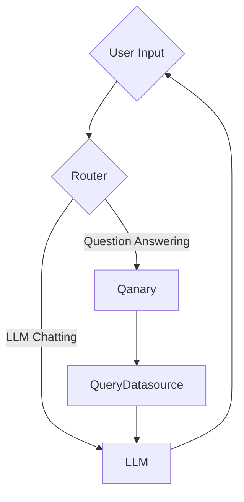

# Graph Architecture

On a high level, the system consists of two processing modes:

- LLM Chatting: Direct interaction with the LLM for general conversation.
- Question Answering: Handling user questions by querying a knowledge graph via Qanary.

## Router (Dialog Manager?)

--> User Prompt\
<-- Routing Decision (switch between LLM Chatting and Process Question modes)

## LLM

--> User Prompt (+ Data Response if present)\
<-- Chatbot Answer

## Qanary

--> User Question\
<-- SPARQL Query

## Query Data Source

--> SPARQL Query\
<-- Data Response
